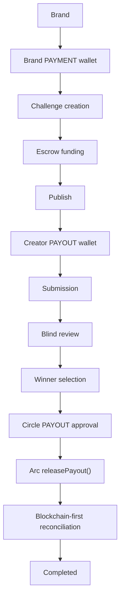
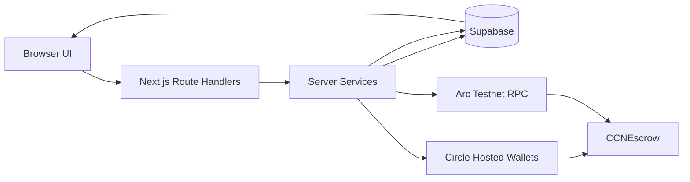

# CCN Judge Documentation

Date: 2026-07-29

Status: judge-facing technical briefing.

Classification: `DEMO READY` / `VALIDATED PROTOTYPE`, not production-ready.

## 1. Executive Summary

CCN, Creator Challenge Network, is a global creative procurement marketplace, global idea marketplace, and stablecoin-native creative settlement platform.

Primary positioning:

```text
Discover the World's Best Ideas.
```

The core problem is that Brands are often constrained by the ideas of one agency, one internal team, or one local network. CCN lets Brands publish creative challenges, source submissions from a global Creator network, evaluate submissions through blind review, select winners, and settle rewards through stablecoin-native infrastructure.

CCN does not position itself as an agency replacement. It complements Brands, agencies, and creative teams.

Blockchain is not the user-facing product. Blockchain is the settlement and verification layer. The user-facing product is the campaign workflow: create, fund, publish, submit, review, select, settle, and verify.

Current maturity statement:

```text
CCN is a validated prototype with a completed end-to-end stablecoin lifecycle on Arc Testnet.
```

## 2. What Was Built

| Area | Built scope |
| --- | --- |
| Brand side | Brand Workspace, Brand PAYMENT wallet, challenge creation, prize configuration, escrow funding, publish, Campaign Workspace, blind review, winner selection, settlement visibility |
| Creator side | Creator Workspace, Creator PAYOUT wallet onboarding, submission draft, final submission, anonymous review identity, payout destination validation |
| Infrastructure | Next.js application, Supabase canonical persistence, Circle Hosted Wallets, Arc Testnet, `CCNEscrow`, blockchain-first reconciliation |

Implemented lifecycle:

```text
Brand challenge -> escrow funding -> publish -> Creator submission -> blind review -> winner finalization -> Hosted PAYOUT approval -> Arc payout -> verified completion
```

AI Campaign Studio is postponed and is not part of the current validated scope.

## 3. Why Arc And Circle

| System | Role in CCN |
| --- | --- |
| Arc | Stablecoin-native settlement network used for escrow funding, payout execution, receipts, and event evidence |
| Circle Hosted Wallets | User-controlled Brand PAYMENT and PAYOUT execution, Hosted Wallet approval, hosted user authorization, transaction status recovery |
| Next.js and Supabase | Product workflow, identity/session authority, lifecycle persistence, recovery coordination, and canonical off-chain state |
| `CCNEscrow` | On-chain custody, funding, payout, refund, authorization, and event emission |

A normal database can record what the app believes happened, but it cannot independently prove that a prize pool was funded or that a winner was paid. CCN uses Arc receipts and contract events as settlement evidence.

Circle callback success alone is insufficient because it proves only that a Hosted Wallet interaction completed. Completed settlement requires a real Arc transaction hash, a successful receipt, and a verified `WinnersPaid` event.

## 4. End-To-End Flow



Stage summary:

| Stage | What happens |
| --- | --- |
| Brand PAYMENT wallet | Brand uses a Circle Hosted Wallet for approval and funding |
| Challenge creation | Brand configures the campaign, prize pool, platform fee, and deadlines |
| Escrow funding | Total required USDC is transferred to `CCNEscrow` |
| Publish | Verified funded campaign becomes discoverable |
| Creator PAYOUT wallet | Creator sets up a verified payout destination |
| Submission | Creator submits once per challenge |
| Blind review | Brand reviews anonymous entries |
| Winner selection | Server locks the winning anonymous entry |
| Circle PAYOUT approval | Hosted Wallet approval authorizes payout execution |
| Arc payout | `releasePayout()` releases creator reward and platform fee |
| Reconciliation | Server verifies receipt and `WinnersPaid` before marking complete |

## 5. Validated Demo Scenario

Completed Smoke Challenge:

| Evidence | Value |
| --- | --- |
| Challenge title | `Coca-Cola Summer Motion Campaign (Smoke Test)` |
| Draft ID | `1062148f-fe4e-4cc1-9a0c-ebcb792b727b` |
| Challenge ID | `0x3289bef91766dd9b9db06508bbc7ec064b66cd0e73192fe5acf59b35fd470769` |
| Winner | `ENTRY-5579` |
| Creator payout wallet | `0x958aa0076487a147830fda5e3a18dd10eb91fd8f` |
| Funding transaction | `0x294e2f2210119386d0590725934729b3a124cf25b289eb3b2cc339928dd62ef4` |
| Payout transaction | `0xd7e94da7aa4081ef205bd5488a2de0433f09ac34a4072827b03bbf5e8fd4e72f` |
| Payout block | `54295403` |
| Canonical final state | `PAYOUT_CONFIRMED` |
| Campaign status | Completed |
| Campaign health | Settled |

Validated final state:

- funding confirmed
- challenge published
- Creator submission completed
- blind review completed
- winner selected
- PAYOUT approval completed
- Arc payout executed
- receipt status successful
- `WinnersPaid` verified
- reconciliation mode `blockchain-first`
- canonical state `PAYOUT_CONFIRMED`

Note on funding evidence: `0x6f21da7f9fcd4c161d97d638dc69578a6bdfc44fe08e43cfef9303b3455338b1` is verified funding evidence for a separate existing Brand challenge. Current repository architecture documents the Coca-Cola smoke funding transaction as `0x294e2f2210119386d0590725934729b3a124cf25b289eb3b2cc339928dd62ef4`.

## 6. Technical Architecture



Canonical ownership:

| Domain | Source of truth |
| --- | --- |
| Account identity | Server session and Supabase account |
| Creator payout wallet | `public.wallets.scope = CREATOR_PAYOUT` |
| Application lifecycle | Supabase lifecycle tables |
| Circle approval and transaction state | Circle plus persisted recovery records |
| Settlement proof | Arc transaction receipt and escrow events |
| Campaign completion | Server reconciliation persisted canonically |

References: `SYSTEM_ARCHITECTURE.md` and `MASTER.md`.

## 7. Smart Contract And Runtime

Public runtime values:

| Item | Value |
| --- | --- |
| Network | Arc Testnet |
| Chain ID | `5042002` |
| Escrow contract | `0x4DCE98F8a35d09F57ECE7A340B8392Ba0Fb7ba3D` |
| Treasury | `0x6d2ca88a7bDA59280D9ad0E41aA87C9acF24Aa1A` |
| Dedicated PAYOUT authority wallet | `0x37e30fe02f1f0a7d46ea7cd254398830be8c30b9` |

Proven `CCNEscrow` responsibilities:

- `fundChallenge` accepts and records funded challenge deposits.
- Contract storage separates prize pool and platform fee.
- `releasePayout` releases creator prize and treasury fee.
- `cancelAndRefund` supports refund behavior.
- AccessControl roles gate privileged settlement actions.
- `ChallengeFunded`, `WinnersPaid`, and `ChallengeRefunded` events provide verification evidence.
- Financial flows use `nonReentrant` and pause guards.

No private keys, mnemonics, keystore material, API secrets, PIN data, recovery material, or encryption material are included in this document.

## 8. Blockchain-First Reconciliation

Settlement completion follows this sequence:

1. Server recovers a real Arc transaction hash.
2. Transaction receipt is retrieved.
3. Receipt status must be successful.
4. Expected contract must match.
5. `WinnersPaid` event must be present.
6. Challenge identity must match.
7. Winner address must match.
8. Amount must match.
9. Fee and treasury conditions must match.
10. Canonical state becomes `PAYOUT_CONFIRMED`.
11. Campaign becomes `Completed`.

Explicit trust rule:

- browser callback is not trusted as settlement evidence
- client-supplied transaction hash is not trusted
- Circle SDK success is not payout proof
- blockchain receipt and event evidence are required
- settlement is not marked complete optimistically

This improves auditability because the application can recover from Hosted Wallet callback ambiguity and rebuild terminal state from public chain evidence.

## 9. Security And Trust Model

| Boundary | Trusted responsibility | Untrusted input | Validation | Canonical evidence |
| --- | --- | --- | --- | --- |
| Browser | Collect user intent and open Hosted SDK | IDs, wallet addresses, transaction hashes, callback text | Server rejects client authority for sensitive fields | None |
| Next.js server | Resolve account, route authority, wallets, Circle operations, and reconciliation | Request bodies and URL params | Server-side ownership and lifecycle guards | Supabase records and Arc reads |
| Supabase | Store canonical application state | Direct client writes to protected tables | RLS, service-layer writes, constraints | Tables and lifecycle records |
| Circle | Hosted Wallet approval and transaction status | Callback success as finality | Server-side status recovery | Circle challenge and transaction IDs |
| Arc | Settlement evidence | None from browser | Receipt, logs, contract reads | Transaction receipt and events |
| Escrow contract | Custody and enforce on-chain state | Unauthorized calls | Roles, deadlines, status, reentrancy guards | Contract storage and events |

Key protections:

- session-derived account authority
- role/purpose wallet separation
- exact winner wallet matching
- EVM validation
- zero-address rejection
- SCA enforcement
- active/live wallet state enforcement
- Arc Testnet enforcement
- escrow, treasury, payout-authority, Brand PAYMENT, and placeholder wallet rejection
- submission deadline enforcement
- no trusted browser transaction evidence
- idempotent recovery
- no automatic duplicate payout approval
- receipt and event verification

## 10. Canonical Wallet Model

| Wallet | Canonical source | Required properties | Use |
| --- | --- | --- | --- |
| Brand PAYMENT | Brand payment account service and scoped mapping | `ARC-TESTNET`, ready/live, server-resolved | Funding approvals and escrow funding |
| Creator PAYOUT | `public.wallets` with `scope = CREATOR_PAYOUT` | `ACTIVE`, `ARC-TESTNET`, `SCA` | Winner payout destination |
| PAYOUT authority | configured payout operator and `BRAND:PAYOUT` scoped mapping | authorized with `RESOLVER_ROLE` | `releasePayout()` execution |

`ccn_wallet_mappings` remains legacy/internal compatibility infrastructure for some scoped flows. It is not a competing Creator PAYOUT authority.

## 11. Important Defects Found And Resolved

| Issue | Impact | Root cause | Resolution | Validation result |
| --- | --- | --- | --- | --- |
| Settlement verifier used wrong wallet source | Verified Creator winner wallet was blocked | Verifier checked legacy `ccn_wallet_mappings CREATOR:PAYOUT` | Verifier now uses Creator Foundation wallet resolver | PASS |
| Legacy Creator mapping was required | Submission/settlement expected the wrong canonical row | Two Creator payout sources competed | `public.wallets.scope = CREATOR_PAYOUT` is canonical | PASS |
| SDK callback reconciled too early | Missing transaction hash safe error | Client called reconcile before payout status recovery | Callback now triggers status/recovery first | PASS |
| Payout transaction recovery gap | Arc hash was not available before reconciliation | Status sequence was incomplete | Server recovery resolves Circle transaction and Arc hash before reconcile | PASS |
| Settlement finality not visible | Completed state required chain proof | Need blockchain-first promotion | Current smoke flow reached `PAYOUT_CONFIRMED` and Completed | PASS |

These defects were found through validation and fixed without weakening security checks.

## 12. What The Demo Proves

The demo proves:

- Brand wallet onboarding works
- challenge funding reaches escrow
- challenge publication works
- Creator wallet onboarding works
- Creator submission works
- blind review works
- deadline enforcement works
- winner selection works
- payout approval works
- Arc payout works
- receipt verification works
- event verification works
- settlement recovery works
- campaign completion works

The demo does not prove:

- production-scale load
- production-grade onboarding UX
- full multi-region reliability
- complete compliance readiness
- formal smart-contract audit
- full automated browser coverage
- mainnet readiness

## 13. Current Limitations

### High

| Limitation | Impact | Current mitigation | Next action |
| --- | --- | --- | --- |
| Brand and Creator sign-in/onboarding UX friction | The core flow works, but the first-use experience is not production polished | Supabase Auth and workspace routing are implemented | Run Authentication and Onboarding UX Audit |
| Production deployment readiness | Internal/demo routes and environment flags need final deployment isolation | Sprint 9 hardening reports and environment contract | Complete deployment readiness checklist |

### Medium

| Limitation | Impact | Current mitigation | Next action |
| --- | --- | --- | --- |
| Automated end-to-end browser coverage is incomplete | Human approval is still needed for live Circle flows | Focused route/service tests cover critical guards | Add browser acceptance coverage |
| Observability gaps | Operators need clearer production telemetry | Lifecycle events and on-chain verification rows exist | Add structured logs and evidence views |
| Local/test persistence adapters remain | Risk if misconfigured in production | Production guards require Supabase mode | Continue adapter isolation |
| Legacy compatibility code remains | Can confuse future wallet changes | Canonical Creator wallet source is documented and tested | Remove or isolate after demo freeze |

### Low

| Limitation | Impact | Current mitigation | Next action |
| --- | --- | --- | --- |
| Pre-existing whitespace debt | Global `git diff --check` can fail on unrelated files | Scoped checks pass for new docs | Clean in a separate approved task |
| Documentation cleanup items | Some older reports contain superseded runtime statements | `MASTER.md` defines authority order | Keep docs updated through change control |

## 14. Production Readiness

| Area | Assessment |
| --- | --- |
| Architecture | Validated |
| Wallet security | Validated for demo/runtime scope |
| Lifecycle integrity | Validated through Supabase and chain evidence |
| Settlement integrity | Validated through Arc receipt and `WinnersPaid` |
| Recovery | Validated for payout recovery sequence and idempotency |
| UX | Functional but not production polished |
| Observability | Partial |
| Testing | Strong focused coverage, incomplete browser E2E |
| Deployment | Requires final hardening |
| Compliance | Not complete |
| Smart-contract assurance | Internally tested/audited, not formally externally audited |

Supported classification:

```text
DEMO READY / VALIDATED PROTOTYPE
```

Production readiness is not claimed because authentication/onboarding UX, deployment isolation, operational observability, production asset storage, compliance readiness, and full browser automation still need focused work.

## 15. Judge Demo Guide

| Step | Presenter shows | Judge should notice | Why it matters |
| --- | --- | --- | --- |
| 1 | Completed Campaign Workspace | Lifecycle has reached Completed/Settled | The product has a terminal state, not just screens |
| 2 | Lifecycle timeline | Funding, review, winner, settlement progression | The campaign is stateful and auditable |
| 3 | Funding evidence | Funding tx and escrow verification | Prize pool was locked before outcome |
| 4 | Published challenge | Creator-visible challenge route | Funding gates publication |
| 5 | Creator submission | Anonymous entry such as `ENTRY-5579` | Creator identity is separated from review |
| 6 | Blind review | Scores and winner selection | Evaluation path is structured |
| 7 | PAYOUT approval state | Circle Hosted PAYOUT flow/recovery state | User-controlled wallet approval is real |
| 8 | Payout transaction hash | Arc payout tx evidence | Settlement was not simulated |
| 9 | Receipt and `WinnersPaid` | Verified event/receipt state | Completion is blockchain-first |
| 10 | `PAYOUT_CONFIRMED` | Canonical final payout state | App state reconciles from chain evidence |
| 11 | Completed/Settled campaign | Final product state | Lifecycle closes cleanly |
| 12 | Explorer/RPC evidence | Public transaction identifiers | Evidence is independently checkable |

## 16. Quick Verification Links

Repository documents:

- `MASTER.md`
- `SYSTEM_ARCHITECTURE.md`
- `FINAL_PLATFORM_VALIDATION_REPORT.md`
- `SYSTEM_ARCHITECTURE_CREATION_REPORT.md`
- `VALIDATION_SPRINT_02_SETTLEMENT_PAYOUT_AUDIT.md`
- `VALIDATION_SPRINT_02_SETTLEMENT_PAYOUT_VERIFIER_FIX_REPORT.md`
- `VALIDATION_SPRINT_02_PAYOUT_RECOVERY_SEQUENCE_FIX_REPORT.md`
- `FUNDING_CANONICAL_PROMOTION_REPAIR_REPORT.md`
- `SPRINT_10_SMOKE_EVIDENCE_INDEX.md`
- `EVIDENCE_INDEX.md`
- `SPRINT_06B_REPORT.md`
- `SPRINT_07_REPORT.md`

Public runtime identifiers:

- Runtime escrow: `0x4DCE98F8a35d09F57ECE7A340B8392Ba0Fb7ba3D`
- Runtime treasury: `0x6d2ca88a7bDA59280D9ad0E41aA87C9acF24Aa1A`
- Payout authority wallet: `0x37e30fe02f1f0a7d46ea7cd254398830be8c30b9`
- Current smoke funding transaction: `0x294e2f2210119386d0590725934729b3a124cf25b289eb3b2cc339928dd62ef4`
- Current smoke payout transaction: `0xd7e94da7aa4081ef205bd5488a2de0433f09ac34a4072827b03bbf5e8fd4e72f`
- Historical verified Brand funding transaction: `0x6f21da7f9fcd4c161d97d638dc69578a6bdfc44fe08e43cfef9303b3455338b1`

## 17. Why This Project Is Technically Credible

CCN is credible beyond a UI prototype because it includes:

- real Circle Hosted Wallet integration
- real Arc Testnet funding and payout transactions
- a deployed escrow contract
- server-side Circle transaction recovery
- blockchain-first reconciliation
- `ChallengeFunded` and `WinnersPaid` event verification
- Supabase canonical lifecycle persistence
- strict Creator payout wallet verification
- fail-closed behavior for missing or unverifiable transaction evidence
- idempotent recovery paths
- documented defects and validation-backed fixes

The strongest technical differentiator is auditable blockchain-first creative settlement with canonical recovery. The app does not merely show a successful UI state; it promotes terminal state only after server-verified chain evidence.

## 18. Final Judge Verdict Summary

| Question | Answer |
| --- | --- |
| Is the project functional? | Yes, for the validated Arc Testnet demo lifecycle |
| Is the Arc integration material? | Yes, Arc provides escrow, payout, receipt, and event verification |
| Is Circle used meaningfully? | Yes, Hosted Wallets are used for PAYMENT and PAYOUT approval/execution |
| Is the settlement real? | Yes, payout is verified through Arc receipt and `WinnersPaid` |
| Is the architecture credible? | Yes, with clear boundaries, canonical persistence, wallet-source rules, and recovery paths |
| Is the project demo-ready? | Yes |
| Is it production-ready? | Not yet |
| Strongest differentiator | Auditable blockchain-first creative settlement with canonical recovery |

## Judge FAQ

### Why not use a normal payment provider?

Normal payment providers can move money, but they do not provide the same public, programmable escrow and event evidence for the full campaign lifecycle.

### Why not pay Creators manually?

Manual payments break the audit trail. CCN ties funding, winner selection, payout execution, and completion to canonical state and on-chain evidence.

### Why use Hosted Wallets?

Hosted Wallets let the product use user-controlled wallet approvals without exposing private keys or building a custom custody model.

### Why is blockchain-first reconciliation necessary?

Because a callback can be incomplete or ambiguous. Finality is derived from Arc receipts and escrow events.

### What prevents payment to the wrong Creator?

The server verifies the finalized winner wallet against the canonical Creator PAYOUT wallet and rejects forbidden, placeholder, wrong-network, or mismatched addresses.

### Can the same account be a Brand and Creator?

Yes. Brand and Creator are workspace roles under one CCN account.

### What happens if Circle callback succeeds but the transaction is pending?

The app enters a recoverable pending state and uses server-side payout status recovery. It does not mark settlement complete without a transaction hash, receipt, and event proof.

### What prevents duplicate payout approval?

Persistent winner finalization attempts and idempotent recovery paths prevent automatic second approval creation while an existing recoverable attempt exists.

### Is smoke mode a lifecycle bypass?

No. Smoke mode shortens deadlines through server-side gates but keeps lifecycle rules active.

### What remains before mainnet?

Production onboarding UX, deployment hardening, observability, production storage, compliance review, mainnet operations, and stronger browser-level automation.
