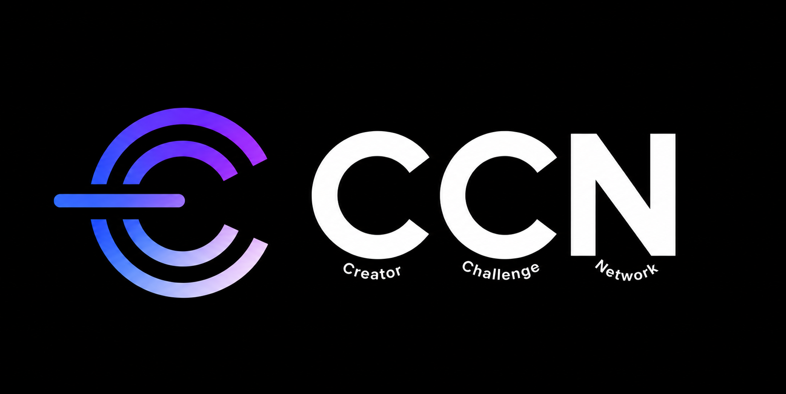
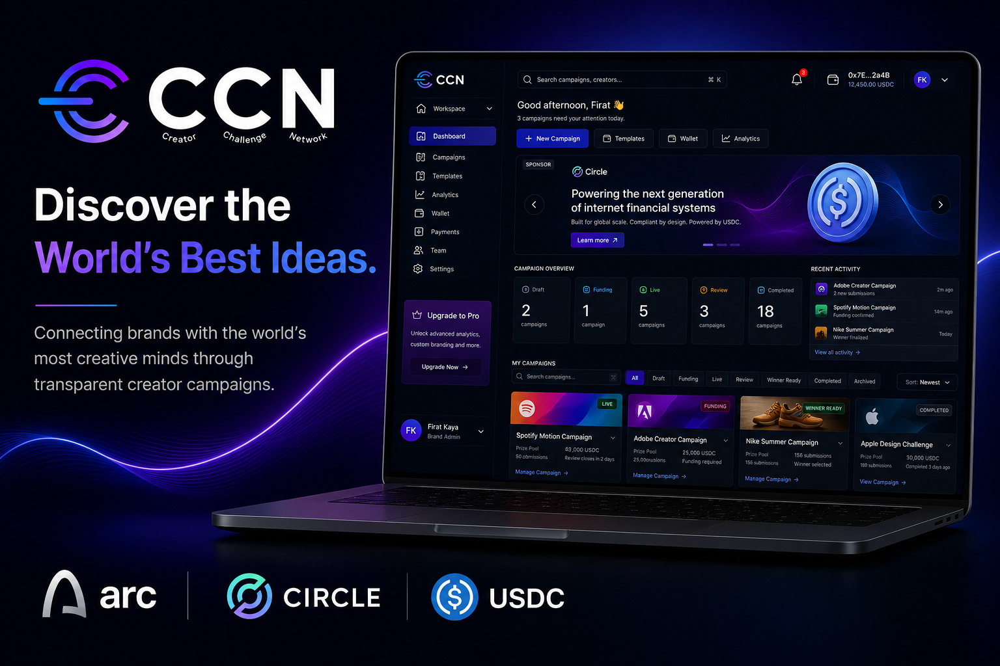
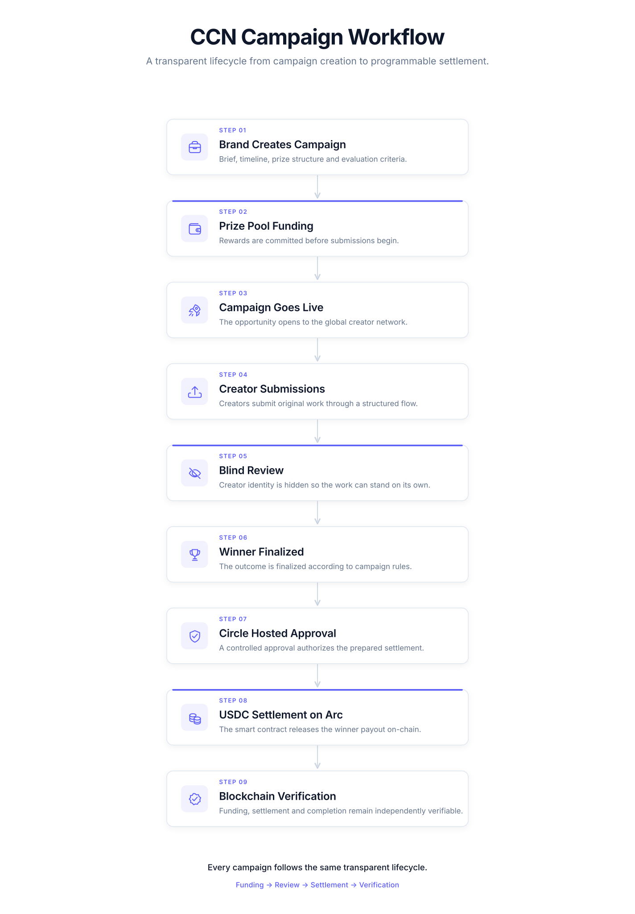
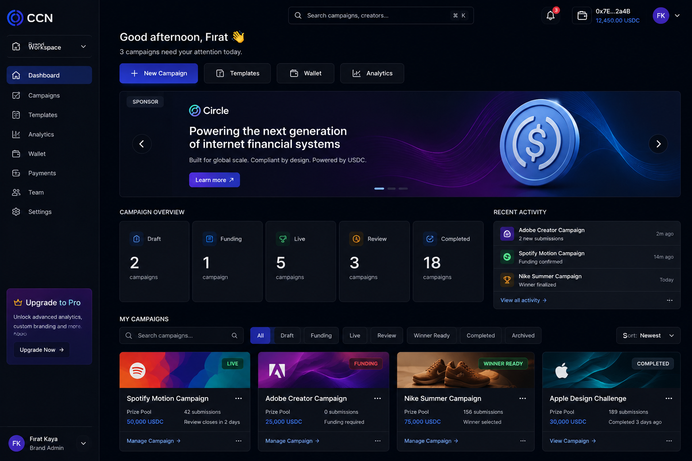
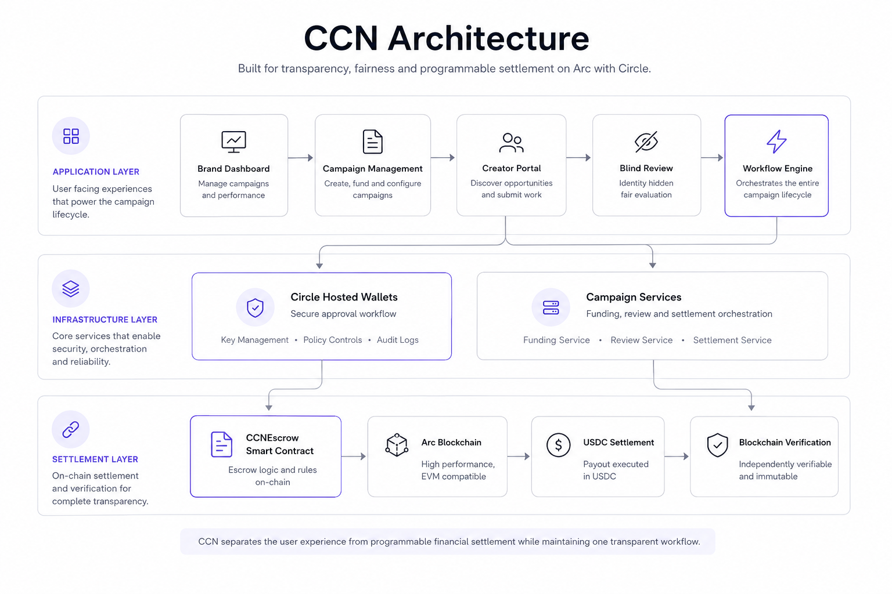

# Discover the World's Best Ideas

**Connecting brands with the world's most creative minds through transparent creator campaigns.**

  

---

## What is CCN?

**CCN (Creator Challenge Network)** is a platform that enables brands to discover exceptional creative ideas through transparent, incentive-driven creator campaigns.

Brands launch campaigns backed by real prize pools. Creators from anywhere in the world submit their work. Submissions are reviewed without exposing creator identity, helping evaluators focus on the work rather than reputation or follower count. Once a winner is finalized, the reward can be settled through programmable USDC payments on Arc using Circle User-Controlled Hosted Wallets.

CCN brings campaign management, fair evaluation, programmable settlement, and on-chain verification into one connected workflow.

---

## The Problem

Creative agencies remain essential partners for global brands, but every agency and internal team is naturally limited by the number of people it employs.

The next breakthrough campaign idea may come from a filmmaker in Türkiye, a designer in Brazil, a photographer in Japan, or a creator in Canada. Most brands do not have an efficient way to reach that talent at scale.

Creators face a different problem. Open campaigns are often managed through disconnected tools such as forms, email, chat platforms, spreadsheets, and manual payments. These tools can collect submissions, but they cannot prove that:

- the prize pool was funded before work began,
- submissions were evaluated through a consistent process,
- the announced winner received the reward,
- the campaign outcome can be independently verified.

CCN addresses both sides of this problem: broader creative access for brands and a more transparent campaign experience for creators.

---

## Why Existing Solutions Fall Short

Current tools solve communication and file collection. They do not establish confidence across the complete campaign lifecycle.

A creator may still need to ask:

- Does the prize money actually exist?
- Will the judging process be fair?
- Can the result be independently verified?
- Will payment arrive without delays or disputes?

A brand may need to coordinate funding, submissions, review, winner selection, and payment across several unrelated systems.

CCN replaces that fragmented process with one structured workflow.

---

## The CCN Solution

CCN expands creative sourcing beyond a single team while making every critical campaign stage traceable.

1. A brand creates a campaign with a clear brief, timeline, prize structure, and evaluation criteria.
2. The prize pool is funded before submissions begin.
3. The campaign opens to a global creator network.
4. Creators submit original work through a structured flow.
5. Submissions are reviewed without exposing creator identity.
6. The winner is finalized according to the campaign rules.
7. Circle Hosted approval authorizes the prepared settlement.
8. The smart contract can release USDC on Arc.
9. Funding, settlement, and completion can be independently verified from on-chain evidence.

---

## Campaign Workflow

  

Every campaign follows the same transparent lifecycle, from campaign creation to programmable settlement and verification.

---

## Product Principles

### Global Creative Participation

Creative opportunities should not be limited by geography, agency size, or existing professional networks.

### Transparent Funding

Campaign rewards should be committed before creators invest their time.

### Fair Evaluation

Submissions should be evaluated on the quality of the work rather than identity, reputation, or follower count.

### Programmable Settlement

Rewards should follow predefined campaign rules instead of disconnected manual payment processes.

### Trust by Design

Funding, evaluation, settlement, and verification should be part of the product workflow from the beginning.

---

## Platform Overview

  

The CCN Brand Workspace brings campaigns, funding, submissions, reviews, analytics, wallet operations, and payout status into one unified interface.

---

## Implementation Status

The current prototype implements the complete campaign lifecycle and includes executable validation for the payout path. This table separates directly verified on-chain execution from implementation and test validation.

| Capability | Evidence status |
|---|---|
| Campaign creation and prize-pool configuration | Implemented and validated |
| Escrow funding | **On-chain verified** |
| Creator submission flow | Implemented and validated |
| Blind review | Implemented and validated |
| Server-derived winner finalization | Implemented and validated |
| Circle Hosted PAYMENT approval | **Executed and funding verified on-chain** |
| Circle Hosted PAYOUT approval flow | Hosted approval completed for FAT-01; idempotency test-validated |
| `releasePayout()` | **On-chain verified for FAT-01** |
| `WinnersPaid` verification path | **On-chain verified for FAT-01** |
| Blockchain-first reconciliation | **Verified from payout receipt and event** |
| `PAYOUT_CONFIRMED` | **Recovered from verified payout evidence** |

Live payout evidence is included only for the FAT-01 challenge where the repository contains a successful receipt, matching `WinnersPaid` event, and `PAYOUT_CONFIRMED` reconciliation.

---

## On-Chain Evidence

| Item | Value |
|---|---|
| Network | Arc Testnet |
| Runtime contract | `0x4DCE98F8a35d09F57ECE7A340B8392Ba0Fb7ba3D` |
| Runtime treasury | `0x6d2ca88a7bDA59280D9ad0E41aA87C9acF24Aa1A` |
| PAYMENT wallet | `0xB1E2700290381396BC2A85bb6C286EaD5e80A5dd` |
| PAYOUT wallet | `0x37e30Fe02f1f0a7d46ea7CD254398830bE8C30b9` |
| Verified funding transaction | `0xb0840e9dcd4509c054e7397641df04d82318838f034e2c8f5355dd1495e5e249` |
| Funded challenge ID | `0xc71562ffa5142a1e1d071cd8107b59591901cd993787b19397c1d8ceba7d294b` |
| Verified payout transaction | [`0x2d11480d…9b38199d`](https://testnet.arcscan.app/tx/0x2d11480d5929d501736fbc976395b9a213f8a79ed711ea2e9447133a9b38199d) |
| Payout challenge ID | `0x98a03a73cab4f10049f2269c348b69031aa78484b15c9098943e5cea07bcbdd9` |
| Payout block | `53726923` |

Funding was verified directly through the Arc Testnet RPC. Arcscan currently does not index this transaction, although the successful receipt, USDC transfer and matching ChallengeFunded event are present on-chain.

The funding transaction emitted `ChallengeFunded` on the runtime contract and moved the canonical campaign into verified funded state.

The payout transaction emitted `WinnersPaid` on the same runtime contract for the FAT-01 challenge and was reconciled into `PAYOUT_CONFIRMED` through blockchain-first verification.

---

## Why Arc?

CCN uses Arc as settlement infrastructure for programmable campaign rewards.

Arc enables the product to connect funding, escrow, settlement, and on-chain verification within one financial lifecycle. This supports:

- programmable escrow-backed rewards,
- fast and low-cost settlement,
- USDC-oriented payment flows,
- transparent on-chain verification,
- blockchain-first reconciliation.

Blockchain is not the product itself. It is the settlement layer that makes the campaign workflow independently verifiable.

---

## Why Circle?

Circle User-Controlled Hosted Wallets integrate secure transaction approvals into the CCN campaign lifecycle.

The current implementation includes:

- Hosted PAYMENT approval for campaign funding,
- Hosted PAYOUT approval preparation and authorization flow,
- controlled authorization of prepared transactions,
- USDC settlement orchestration connected to the application workflow.

This allows wallet approvals and settlement to operate as part of the product instead of as a separate manual process.

---

## Technical Architecture

  

CCN separates the product experience from programmable financial settlement while keeping both connected through one workflow.

### Application Layer

- Brand workspace
- Campaign management
- Creator submission flow
- Blind review
- Workflow engine

### Infrastructure Layer

- Circle User-Controlled Hosted Wallets
- Hosted approval orchestration
- Campaign services
- Funding, review, and settlement coordination
- Blockchain reconciliation

### Settlement Layer

- `CCNEscrow` smart contract
- Arc Testnet
- USDC settlement path
- On-chain event verification

---

## Technology Stack

### Product

- Next.js
- React
- TypeScript
- Tailwind CSS

### Blockchain

- Arc Testnet
- Solidity
- Escrow-based settlement
- Blockchain-first reconciliation

### Payments

- Circle User-Controlled Hosted Wallets
- Hosted PAYMENT approval
- Hosted PAYOUT approval flow
- USDC

---

## Vision

The future of creative marketing will not be defined only by who employs the largest creative team. It will also be defined by who can discover the best ideas from a global network.

CCN enables brands to expand creative participation beyond traditional boundaries while giving creators a more transparent and trustworthy campaign experience.

Creator campaigns are the first use case. The same infrastructure can support creative bounties, open innovation programs, community-led product design, brand collaborations, and other structured relationships between organizations and independent creators.

Our long-term goal is to make transparent creator collaboration a standard rather than an exception.

---

## Built on Arc

CCN was designed and built during the **Build on Arc Hackathon**.

The project demonstrates how Arc, Circle, USDC, and programmable settlement can support a transparent creator campaign lifecycle from funding through verifiable settlement infrastructure.

---

## License

MIT
