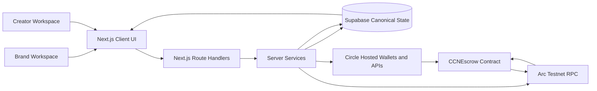
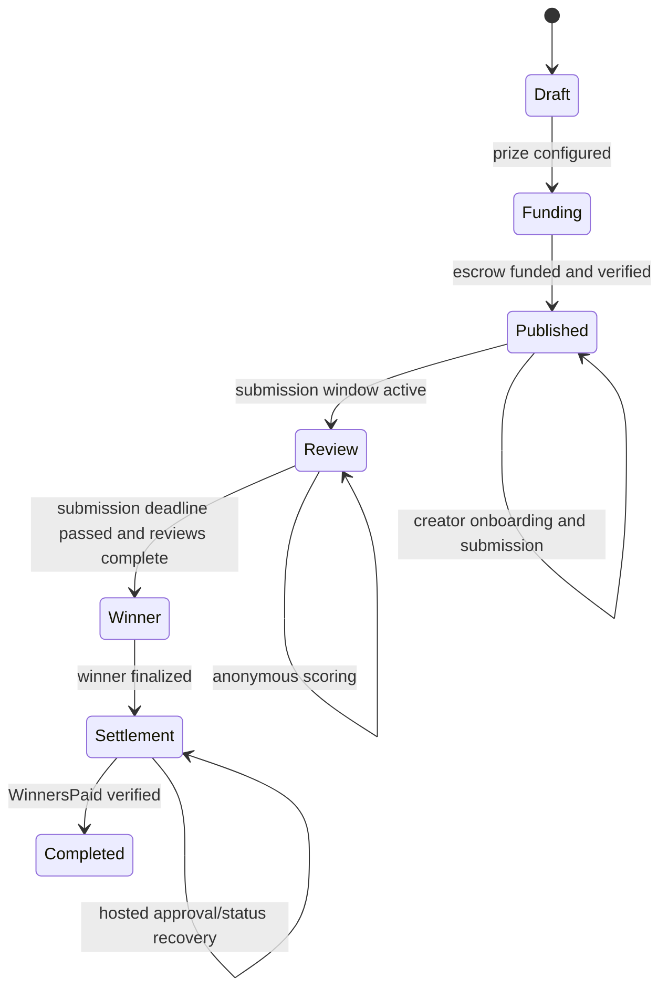
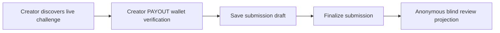
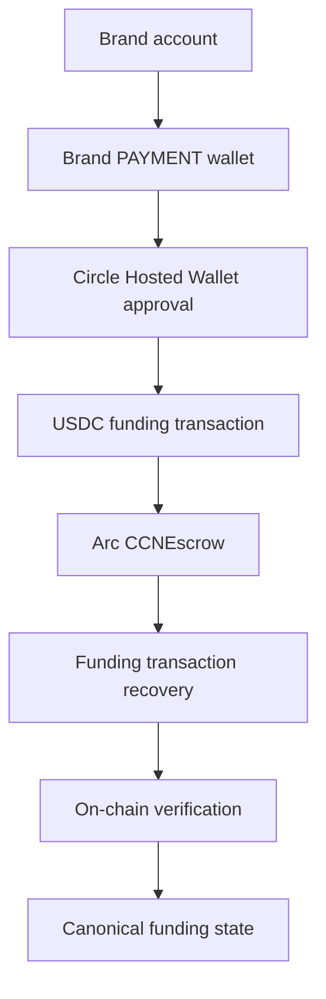
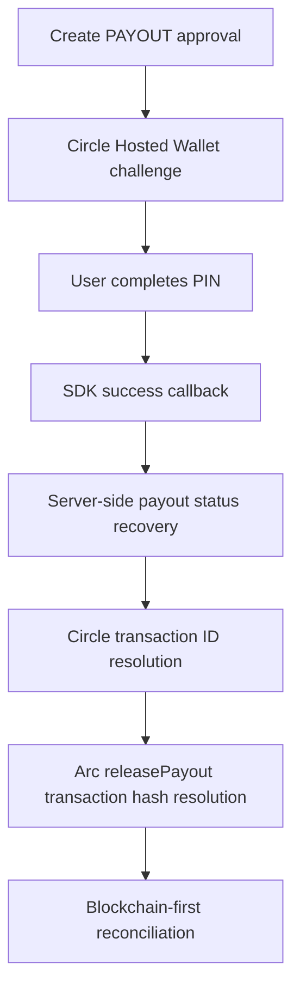
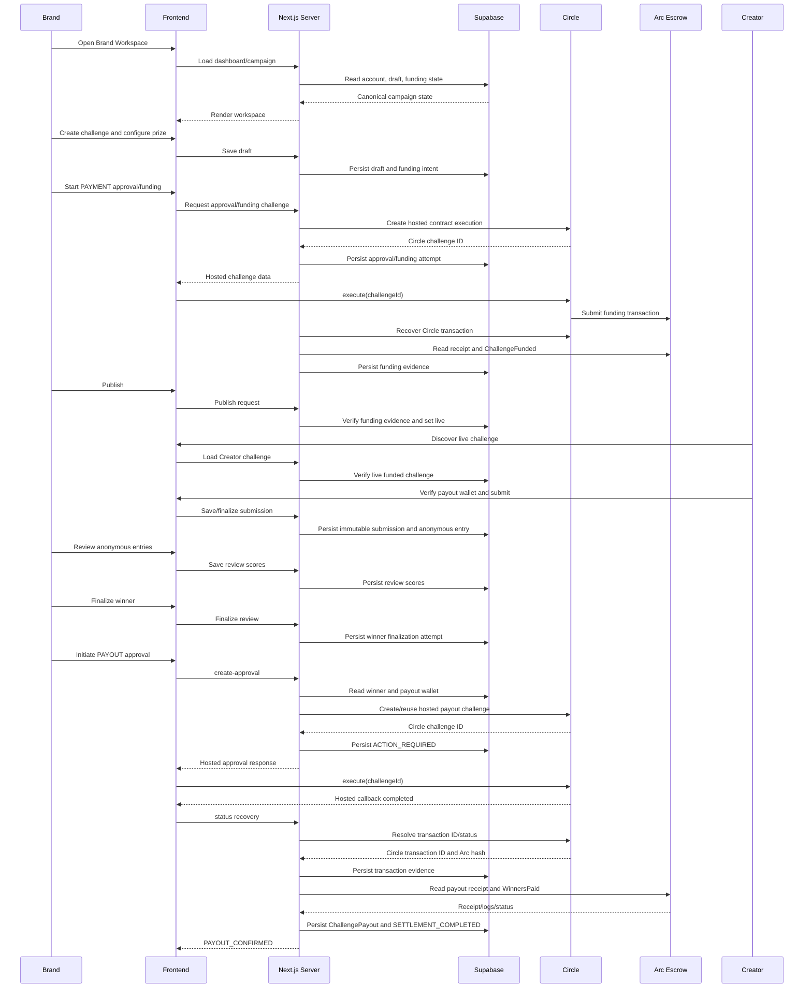

# CCN System Architecture

Date: 2026-07-29

Repository: `creator-challenge-network`

Status: current validated architecture reference.

This document describes the implemented and validated CCN architecture as it exists in this repository and active Arc Testnet/Supabase runtime. It is not a marketing document, product roadmap, or release note. Legacy compatibility and test-only paths are labeled explicitly.

## 1. Architecture Summary

CCN is a global creative procurement marketplace, global idea marketplace, and stablecoin-native creative settlement platform.

The product coordinates Brand-funded creator challenges. Brands define and fund campaigns. Creators submit work. Reviews are performed through anonymous projections. Winners are finalized server-side. Settlement is executed through a Circle Hosted PAYOUT wallet and verified on Arc before the application marks payout complete.

Blockchain is the settlement layer, not the product identity layer. Product identity and lifecycle state are stored in Supabase. Arc provides escrow custody and immutable funding/payout evidence. Circle Hosted Wallets provide user-controlled wallet approval and execution infrastructure. Next.js coordinates UI flows, route handlers, server-side validation, Circle calls, Arc RPC reads, and canonical persistence.



## 2. System Boundaries

| Boundary | Responsibilities | Trusted inputs | Untrusted inputs | Outputs | Failure behavior | Canonical or derived |
| --- | --- | --- | --- | --- | --- | --- |
| Client UI | Render workspaces, collect user actions, open Circle Hosted SDK, display canonical state | Server responses | Browser state, form input, URL params, SDK callback text | API requests, visible status | Shows safe errors and recoverable pending states | Derived |
| Next.js route handlers | Parse requests, enforce route contracts, reject client authority overrides, call services | Server session/context, route params after validation | Request body, browser-supplied IDs, client transaction fields | JSON responses, redirects | Sanitized errors | Workflow authority |
| Server services | Resolve canonical state, validate lifecycle, create Circle operations, verify Arc evidence | Supabase data, server env, Circle read responses, Arc receipts | Client-provided authority, payout addresses, hashes | Persisted records, normalized DTOs | Fail closed with safe errors | Workflow authority |
| Supabase persistence | Store account, wallet, challenge, submission, review, winner, verification, lifecycle records | Server service writes | Direct browser writes to protected tables | Canonical rows | Constraint or RLS errors | Canonical application state |
| Circle APIs and Hosted SDK | Hosted wallet approval, user-controlled wallet execution, transaction status | Server-created sessions, hosted user approval | Browser cannot forge canonical execution data | Circle challenge IDs, transaction IDs, transaction statuses | Pending, terminal failure, recoverable status | Execution provider, not final settlement authority |
| Arc RPC | Read chain ID, receipts, logs, contract state | Deployed contract state | None from browser | Receipts, logs, role/status reads | Transient RPC errors become safe/retryable application states | Settlement evidence source |
| Escrow smart contract | Custody USDC, enforce funding/payout/refund status, emit events, prevent duplicate payout | On-chain transactions authorized by ERC-20 allowance and roles | Unauthorized callers | Contract storage/events | Reverts on invalid status/role/deadline | Settlement authority |

The browser is untrusted. The Next.js server is the workflow authority. Supabase is the canonical off-chain state store. Circle is the wallet execution provider. Arc and `CCNEscrow` are the settlement evidence and execution authority.

## 3. Identity And Account Model

CCN uses a canonical account model in Supabase. One authenticated Supabase user maps to one CCN account row. A CCN account may support more than one workspace role:

- `is_brand = true`
- `is_creator = true`
- `status = ACTIVE`

Brand and Creator are workspace roles on the same account, not separate custody or identity systems. A dual-role account can navigate to `/dashboard` for Brand Workspace and `/dashboard/creator` for Creator Workspace. Workspace-specific route handlers resolve the requested role server-side.

Account IDs are application identifiers. They are not wallet addresses, Circle user IDs, private keys, or session tokens. Role-specific behavior is derived from account capabilities and route context.

## 4. Canonical Wallet Architecture

A wallet purpose must have exactly one authoritative runtime source.

| Wallet purpose | Account role | Canonical source | Resolver | Required status | Network | Usage |
| --- | --- | --- | --- | --- | --- | --- |
| Brand payment | `BRAND` | scoped wallet mapping used by Brand payment account service | `getBrandPaymentAccount(ccnAccountId)` | live/ready | `ARC-TESTNET` | Approval allowance and escrow funding |
| Payout authority | `BRAND` / configured payout operator | scoped `BRAND:PAYOUT` mapping and server env binding | payout authority services in `winner-finalization.server.ts` | live | `ARC-TESTNET` | Authorized `releasePayout()` execution |
| Creator payout | `CREATOR` | `public.wallets` | `getVerifiedCreatorPayoutWallet(accountId)`, `getVerifiedCreatorPayoutMapping(accountId)` | `ACTIVE` | `ARC-TESTNET` | Winner payout destination |

Creator payout wallet requirements:

- source: `public.wallets`
- scope: `CREATOR_PAYOUT`
- status: `ACTIVE`
- blockchain: `ARC-TESTNET`
- account type: `SCA`

Legacy/internal compatibility:

- `ccn_wallet_mappings` remains in the repository for Brand payment and historical/internal scoped mapping compatibility.
- It must not be treated as a second canonical Creator payout source.
- Runtime Creator payout validation resolves through the Creator Foundation wallet model.

## 5. Campaign Domain Model

Major implemented campaign entities:

- Challenge draft: mutable Brand configuration before publication.
- Challenge ID: bytes32-compatible public/on-chain challenge identifier.
- Funding intent: exact funding scope and escrow contract binding.
- Publication state: draft/live readiness for public discovery.
- Funding state: not-started, ready, approved, funding-pending, funded/live style canonical state.
- Escrow state: not-created or verified.
- Submission: Creator-owned draft/submitted entry.
- Anonymous entry ID/code: blind-review identifier such as `ENTRY-5579`.
- Review score: Brand review criteria and completion status.
- Winner finalization attempt: canonical winner and payout operation record.
- Payout approval: Circle Hosted Wallet challenge state.
- Payout transaction evidence: Circle transaction ID and Arc transaction hash.
- Settlement/reconciliation state: Arc receipt/event verification and `PAYOUT_CONFIRMED`.

Identifier taxonomy:

| Identifier | Example | Meaning | Source |
| --- | --- | --- | --- |
| `draftId` | `1062148f-fe4e-4cc1-9a0c-ebcb792b727b` | Internal campaign draft/workspace ID | Supabase challenge draft |
| `challengeId` | `0x3289bef91766dd9b9db06508bbc7ec064b66cd0e73192fe5acf59b35fd470769` | Public/on-chain challenge ID | Draft/funding intent/contract |
| `fundingIntentId` | `5e75e454-b742-4e75-8766-15e40ce0d31c` | Funding scope binding | Draft funding state |
| anonymous entry code | `ENTRY-5579` | Reviewer-facing submission label | Submission service |
| submission ID | `d9d21c62-e3c6-4658-90f9-15d69f960bbc` | Internal submission row ID | Supabase submissions |
| Circle challenge ID | `7ae45d24-c5b7-5f43-92a2-6bb27685ac8a` | Hosted Wallet approval challenge | Circle recovery state |
| Circle transaction ID | `8ace47c1-9ec5-5514-98dc-25a7c76cbbf9` | Circle transaction object | Circle status recovery |
| Arc transaction hash | `0xd7e94da7aa4081ef205bd5488a2de0433f09ac34a4072827b03bbf5e8fd4e72f` | On-chain transaction evidence | Arc receipt |

## 6. Campaign Lifecycle

Validated lifecycle:



| State | Entry conditions | Canonical owner | Allowed actions | Blocking conditions | Exit conditions | Evidence |
| --- | --- | --- | --- | --- | --- | --- |
| Draft | Brand creates challenge | `ccn_challenge_drafts` | edit draft, configure prize | invalid draft fields | valid prize/deadlines | draft row |
| Funding | valid funding intent exists | funding records and draft funding state | check wallet, approve, fund | missing wallet, insufficient allowance, RPC/Circle errors | verified funding | funding attempt and receipt |
| Published | funding verified | draft publication state | creator discovery/submission | unverified escrow, unpublished state | deadline progression | live draft |
| Review | challenge live and submissions exist | submissions and review scores | blind review scoring | identity leak, incomplete scores | all scores complete and deadline passed | review score rows |
| Winner | finalization permitted | winner finalization attempt | finalize winner, prepare settlement | deadline not passed, mismatch, duplicate winner | payout approval ready | winner attempt |
| Settlement | winner finalized | winner attempt and on-chain verification | create/recover payout approval, reconcile | missing tx hash, failed Circle tx, failed receipt/event | verified payout | `ChallengePayout` evidence |
| Completed | payout verified | winner attempt/lifecycle event | view evidence | none for current terminal state | terminal | `PAYOUT_CONFIRMED` |

Winner finalization is intentionally blocked before the submission deadline. Smoke mode shortens deadlines only through server-side test gates; it does not bypass this rule.

Submission path inside Published:



## 7. Brand Funding Flow

Real funding sequence:



Funding implementation covers:

- payment account resolution
- wallet balance and allowance checks
- approval creation
- Hosted Wallet PIN interaction
- funding challenge creation
- Circle transaction recovery
- transaction hash persistence
- Arc receipt verification
- `ChallengeFunded` verification
- sponsor, amount, fee, and contract-state verification
- canonical promotion to funded/live state

Validated Nike funding transaction:

```text
0x6f21da7f9fcd4c161d97d638dc69578a6bdfc44fe08e43cfef9303b3455338b1
```

Validated Coca-Cola smoke funding transaction:

```text
0x294e2f2210119386d0590725934729b3a124cf25b289eb3b2cc339928dd62ef4
```

Blockchain evidence is required because neither a Circle callback nor a locally persisted attempt is sufficient to prove escrow funding.

## 8. Submission And Blind Review

Creator submission requires a verified Creator PAYOUT wallet before save/finalize can proceed. The canonical submission path derives the payout wallet server-side through `getVerifiedCreatorPayoutMapping()` and does not accept a client-supplied payout address.

Submission supports:

- draft save
- refresh persistence
- final submission
- one submission per creator/challenge
- immutable submitted state
- anonymous entry code generation

Blind review uses an identity-stripped projection. Reviewer-visible data includes the anonymous entry code, submission content, and review metadata. Server-side data retains creator account and wallet fields, but they are not exposed in the blind projection.

Validated winner:

```text
ENTRY-5579
```

Identity hidden from reviewers:

- creator account ID
- creator email/display identity
- creator wallet address
- Circle user ID
- wallet ID

## 9. Winner Finalization

Winner finalization is represented by a persistent winner finalization attempt. It locks the selected anonymous submission and payout data needed for settlement.

Relevant implementation:

- `src/app/api/dashboard/finalize-review/route.ts`
- `src/app/api/create-challenge/winner-finalization/route.ts`
- `src/services/create-challenge/winner-finalization.server.ts`
- `src/types/winner-finalization.ts`

Corrected verifier source:

```text
getVerifiedCreatorPayoutMapping(winner.creatorAccountId)
```

Preserved payout wallet checks:

- valid EVM address
- non-zero address
- exact match with canonical Creator payout wallet
- `ARC-TESTNET`
- `SCA`
- active/live wallet state
- not runtime escrow
- not treasury
- not payout authority wallet
- not Brand PAYMENT wallet
- not placeholder address

Important states:

- `READY_FOR_FINAL_SELECTION`
- `APPROVAL_CREATION_IN_PROGRESS`
- `ACTION_REQUIRED`
- `FINALIZATION_IN_PROGRESS`
- `TRANSACTION_SUBMITTED`
- `RECONCILIATION_REQUIRED`
- `FINALIZATION_FAILED`
- `PAYOUT_CONFIRMED`

## 10. Payout Approval And Execution

Correct runtime sequence:



Hosted Wallet callback success means the approval interaction completed. It does not itself prove that an Arc transaction was mined.

Canonical fields:

- Circle challenge ID: `circle_challenge_id`
- Circle transaction ID: `circle_transaction_id`
- Arc transaction hash: `transaction_hash`
- attempt state: `state` and `attempt_state.state`
- failure state: `FINALIZATION_FAILED` with sanitized error message

The client must not call blockchain-first reconciliation until a valid Arc transaction hash is available through server-side recovery or canonical state.

## 11. Payout Recovery Model

Status endpoint:

- Route: `src/app/api/create-challenge/winner-finalization/route.ts`
- Mode: `status`
- Service: `getWinnerPayoutStatusForFinalizedAttempt()`
- Recovery helper: `resolvePayoutTransaction()`

Recovery behavior:

- uses existing Circle challenge/transaction identifiers
- does not create a second approval automatically
- resolves Circle transaction ID when available
- resolves Arc transaction hash when available
- persists recovered transaction fields
- invokes blockchain-first reconciliation only after a transaction hash exists
- returns pending state if no transaction hash exists yet
- maps terminal negative Circle statuses to `FINALIZATION_FAILED`

Manual recovery:

- Settlement tab exposes `Refresh Payout Status`.
- Manual `Reconcile Settlement` remains blocked while no transaction hash exists.

Former incorrect sequence:

```text
SDK callback
-> direct reconcile without hash
-> missing transaction hash safe error
```

Why unsafe: it attempted blockchain-first reconciliation before the server had a transaction hash to verify. The sequence was fixed so SDK success leads to status recovery first.

## 12. Blockchain-First Reconciliation

Implementation meaning:

1. A valid Arc transaction hash exists.
2. Server retrieves transaction receipt.
3. Receipt status is successful.
4. Correct contract is verified.
5. `WinnersPaid` event is verified.
6. Challenge identity is verified.
7. Winner address is verified.
8. Payout amount is verified.
9. Fee and treasury conditions are verified.
10. Canonical settlement state transitions to confirmed.
11. Campaign reaches Completed.

Off-chain callback state alone is insufficient because it proves at most that a hosted approval interaction completed. The settlement claim is only valid after Arc receipt and event verification.

Validated Coca-Cola smoke payout transaction:

```text
0xd7e94da7aa4081ef205bd5488a2de0433f09ac34a4072827b03bbf5e8fd4e72f
```

Validated result:

- receipt success
- block: `54295403`
- `WinnersPaid` verified
- event stored as `ChallengePayout`
- canonical state: `PAYOUT_CONFIRMED`
- final contract status: `PAID`
- campaign lifecycle event: `SETTLEMENT_COMPLETED`
- campaign health: Settled

## 13. Smart Contract Architecture

Runtime escrow:

```text
0x4DCE98F8a35d09F57ECE7A340B8392Ba0Fb7ba3D
```

Runtime treasury:

```text
0x6d2ca88a7bDA59280D9ad0E41aA87C9acF24Aa1A
```

Dedicated PAYOUT authority wallet:

```text
0x37e30fe02f1f0a7d46ea7cd254398830be8c30b9
```

Contract file:

- `contracts/src/CCNEscrow.sol`

Contract responsibilities:

- accept funded challenge deposits through `fundChallenge`
- store sponsor, prize pool, platform fee, deadlines, winner count, and status
- store prize distribution
- release winners and treasury fee through `releasePayout`
- refund sponsor through `cancelAndRefund`
- emit `ChallengeFunded`, `WinnersPaid`, and `ChallengeRefunded`
- enforce `RESOLVER_ROLE` for payout/refund
- enforce `PAUSER_ROLE` for pause/unpause
- enforce `DEFAULT_ADMIN_ROLE` for role administration through OpenZeppelin AccessControl
- use `nonReentrant` and `whenNotPaused` on financial flows

Role architecture:

- `DEFAULT_ADMIN_ROLE`: runtime admin/treasury address.
- `RESOLVER_ROLE`: authorized resolver/PAYOUT wallet role for settlement/refund.
- `PAUSER_ROLE`: pause control.

Contract limitations visible from code:

- Contract does not know Brand/Creator identities.
- Contract does not run review or winner selection logic.
- Resolver is responsible for off-chain policy validation before payout/refund.

## 14. Data Persistence

Supabase is canonical production-oriented application state.

| Table/model | Purpose | Canonical fields | State ownership | Circle relation | Arc relation |
| --- | --- | --- | --- | --- | --- |
| `accounts` | CCN account and workspace roles | account ID, Supabase user ID, role flags, status | identity/account | none | none |
| `creator_profiles` | Creator profile extension | account ID, display fields | Creator profile | none | none |
| `circle_users` | Circle user association | account ID, Circle user ID | wallet onboarding | Circle user ID | none |
| `wallets` | Creator Foundation wallet model | account ID, scope, wallet ID/address, blockchain, status | Creator payout wallet | Circle wallet ID | wallet address |
| `ccn_wallet_mappings` | scoped wallet mapping and legacy/internal compatibility | account, role, purpose, wallet ID/address, status | Brand payment and compatibility | Circle wallet ID | wallet address |
| `ccn_challenge_drafts` | campaign/draft lifecycle | draft ID, challenge ID, funding intent, publication/funding/escrow states, draft JSON | challenge lifecycle | funding challenge IDs in state | funding tx and contract refs |
| `ccn_challenge_funding_records` | funding scope records | draft/account/funding intent scope, record state | funding lifecycle | approval/funding IDs | tx hashes |
| `ccn_wallet_approval_attempts` | approval attempts | scope, Circle IDs, state | Brand funding approval | Circle challenge/transaction | approval tx hash |
| `ccn_funding_attempts` | funding attempts | scope, Circle IDs, tx hash, state | escrow funding | Circle challenge/transaction | funding tx hash |
| `ccn_creator_submissions` | creator submissions | submission ID, challenge ID, creator account, anonymous code, status | submission lifecycle | none | creator wallet address |
| `ccn_submission_finalize_keys` | submission idempotency | finalize key, submission ID | submit once/finalize once | none | none |
| `ccn_review_scores` | blind review scores | score ID, challenge ID, submission ID, score/notes/status | review lifecycle | none | none |
| `ccn_winner_finalization_attempts` | winner and payout operation | scope, state, Circle IDs, tx hash, attempt JSON | winner/settlement lifecycle | Circle challenge/transaction | payout tx hash |
| `ccn_onchain_verifications` | chain evidence | tx hash, event type, receipt/event flags, verification JSON | funding/payout proof | optional Circle IDs | receipt/event evidence |
| `ccn_lifecycle_events` | audit trail | event ID, draft/challenge, event type, metadata | lifecycle activity | optional Circle IDs | optional tx evidence |
| `auth_audit_events` | auth/onboarding audit | event ID, account ID, event type, metadata | auth audit | optional | none |

Local/test persistence:

- `.local/create-challenge-flow.json` is local file-backed development/test persistence.
- `.local/internal-wallet-spike-store.json` is local/internal wallet spike persistence.
- manual fixture upload state is local development-only.

Production limitation:

- No silent filesystem fallback is allowed in production.
- Production must use Supabase-backed persistence.

## 15. Trust And Security Model

| Actor/system | Trust level | Allowed authority | Explicitly forbidden |
| --- | --- | --- | --- |
| Browser | untrusted | user intent, form input, visible hosted SDK interaction | canonical wallet choice, treasury choice, payout address override, transaction hash invention, deadline bypass |
| Next.js server | trusted workflow authority | validate account, resolve wallets, create Circle operations, persist state, verify receipts | exposing secrets, trusting client authority overrides |
| Circle | wallet execution provider | Hosted approval, transaction status, wallet metadata | final settlement proof without Arc evidence |
| Arc | settlement evidence layer | receipt/log/status verification | product identity or review policy |
| Supabase | canonical app state | accounts, wallets, lifecycle, submissions, attempts, evidence | private key/PIN storage |

Protections:

- address normalization
- forbidden-address checks
- role/purpose separation
- wallet status validation
- SCA enforcement
- network enforcement
- submission and review deadline enforcement
- persistent idempotency records
- client-secret distrust
- no private key exposure in application flows
- blockchain-first terminal state verification

## 16. Idempotency And Failure Recovery

| Flow | Idempotency / recovery behavior |
| --- | --- |
| Challenge creation | draft ID scopes persisted draft state; smoke creation avoids duplicate drafts for the same isolated entry behavior |
| Funding approval | approval attempts are scoped and recoverable; transaction hashes persist |
| Funding recovery | Circle challenge/transaction and Arc receipt/event repair funding state without new funding |
| Publication | publish requires verified funding; route can return canonical current state |
| Submission finalize | finalize keys and one-submission constraint prevent duplicate submitted records |
| Winner finalization | persistent lock and finalization attempt prevent duplicate or mismatched winner records |
| Payout approval | existing Circle challenge is reused; repeated create-approval does not create another challenge automatically |
| Payout status recovery | status route reuses existing identifiers, resolves Circle transaction/hash when available |
| Reconciliation | transaction hash keyed evidence is idempotent; terminal `PAYOUT_CONFIRMED` returns existing state |
| Settlement completion | lifecycle event uses stable upsert behavior |

Terminal state behavior:

- `PAYOUT_CONFIRMED` is terminal for payout.
- `FINALIZATION_FAILED` is visible and recoverable only where business rules allow.
- Missing payout transaction hash blocks reconciliation safely.

## 17. Smoke Test Architecture

Normal challenge entry:

```text
/create-challenge?new=1
```

Isolated smoke entry:

```text
/create-challenge?mode=smoke
```

Smoke gates:

- `CCN_SMOKE_TEST_MODE=true`
- runtime blockchain is `ARC-TESTNET`
- chain ID is `5042002`
- `CCN_MIN_SUBMISSION_WINDOW_SECONDS` is a valid positive integer
- `CCN_MIN_REVIEW_WINDOW_SECONDS` is a valid positive integer

Smoke draft behavior:

- server sets `challenge.isSmokeTest = true`
- submission deadline is server-now plus configured smoke submission window
- review deadline is submission deadline plus configured smoke review window
- existing lifecycle rules remain active
- normal challenge behavior is unchanged
- existing production challenges are not mutated into smoke challenges

Smoke mode exists to validate the full lifecycle under shortened deadlines without weakening winner finalization or payout policy.

## 18. Runtime Deployment Model

Runtime components:

- Next.js application
- Supabase Auth and database
- Circle API
- Circle Hosted Wallet SDK
- Arc Testnet RPC
- deployed `CCNEscrow`

Environment categories:

| Category | Examples | Exposure |
| --- | --- | --- |
| Public client-safe | `NEXT_PUBLIC_SUPABASE_URL`, `NEXT_PUBLIC_SUPABASE_ANON_KEY`, `NEXT_PUBLIC_CIRCLE_APP_ID` | may be in client bundle |
| Server-only secrets | `SUPABASE_SERVICE_ROLE_KEY`, `CIRCLE_API_KEY`, Entity Secret material | server only |
| Persistence mode | `CCN_LIFECYCLE_PERSISTENCE` | server/runtime config |
| Contract config | `CCN_ESCROW_CONTRACT_ADDRESS`, `CCN_PAYOUT_TREASURY_ADDRESS` | public addresses |
| Payout operator config | `CCN_PAYOUT_ACCOUNT_ID`, `CCN_PAYOUT_WALLET_ID`, `CCN_PAYOUT_WALLET_ADDRESS` | account/wallet identifiers; avoid public overexposure |
| Chain config | Arc RPC URL, chain ID `5042002` | public/read-only |
| Smoke config | `CCN_SMOKE_TEST_MODE`, minimum window env vars | must be disabled or guarded outside test/demo contexts |

Private keys, mnemonics, API secrets, PIN material, recovery material, Circle user tokens, encryption keys, cookies, and database credentials must never appear in documentation, client bundles, logs, or committed files.

## 19. Observability

User-visible observability:

- campaign lifecycle status
- activity feed events
- funding status
- payout approval state
- settlement status
- transaction hash links when available
- receipt status
- block number
- campaign health

Server/database evidence:

- `ccn_lifecycle_events`
- `ccn_onchain_verifications`
- funding and winner attempt records
- review score rows
- submission rows

Blockchain evidence:

- Arc receipts
- `ChallengeFunded`
- `WinnersPaid`
- contract status reads
- role reads

Gaps:

- production-grade structured logging is not fully documented
- lifecycle event UI does not yet surface every persisted event
- explorer availability can lag or be incomplete, so RPC verification remains primary

## 20. Known Architectural Debt

### High

- Production deployment still needs strict internal route isolation and operator-route hardening.
- Production route authorization must remain under review for every mutation route.
- Smoke/test flags must be verified disabled or explicitly gated in any public deployment.

### Medium

- Local file-backed adapters remain in the repository for development and deterministic testing.
- Legacy `ccn_wallet_mappings` compatibility code remains; Creator payout must continue using `public.wallets`.
- Some validation coverage is static/mock because live Circle and Arc flows require human approval and testnet funds.
- Production asset storage and upload policy need continued hardening.

### Low

- Several historical/internal paths still include `spike` naming.
- Global `git diff --check` has pre-existing unrelated EOF whitespace debt.
- More UI-level automated regression screenshots would improve confidence.

Resolved architecture defects:

- stale escrow display
- ambiguous Brand wallet chip semantics
- legacy Creator payout mapping mismatch
- settlement verifier source mismatch
- premature payout reconciliation after SDK callback
- funding state promotion gaps
- approval/funding hash restoration gaps
- workspace navigation inconsistency

## 21. Architectural Invariants

1. Blockchain is settlement layer, not product identity.
2. Settlement remains inside Campaign Workspace.
3. Creator payout wallet comes from canonical Creator Foundation source.
4. Browser never supplies trusted payout transaction evidence.
5. Circle callback success is not blockchain settlement proof.
6. Reconciliation requires Arc transaction hash.
7. Completed requires verified receipt and `WinnersPaid` event.
8. Winner finalization respects submission deadline.
9. Smoke mode cannot alter normal production lifecycle rules.
10. No second canonical wallet source for the same purpose.
11. No client-side payout address authority.
12. Existing winner/submission records remain immutable during settlement recovery.
13. Funding and payout terminal states require chain evidence.
14. PAYOUT wallet authority is role-gated by `RESOLVER_ROLE`.
15. Supabase is canonical production application state.

## 22. End-To-End Sequence Diagram



## 23. Repository Map

Campaign Workspace UI:

- `src/app/dashboard/page.tsx`
- `src/app/dashboard/challenges/[draftId]/page.tsx`
- `src/features/dashboard/components/brand-dashboard.tsx`
- `src/features/dashboard/components/campaign-workspace.tsx`
- `src/features/dashboard/components/campaign-workspace-tabs.tsx`

Create-challenge API routes:

- `src/app/api/create-challenge/draft/route.ts`
- `src/app/api/create-challenge/session/route.ts`
- `src/app/api/create-challenge/payment-account/route.ts`
- `src/app/api/create-challenge/payment-wallet/initialize/route.ts`
- `src/app/api/create-challenge/payment-overview/route.ts`
- `src/app/api/create-challenge/preflight/route.ts`
- `src/app/api/create-challenge/approve/route.ts`
- `src/app/api/create-challenge/approval-recovery/route.ts`
- `src/app/api/create-challenge/fund/route.ts`
- `src/app/api/create-challenge/reconcile/route.ts`
- `src/app/api/create-challenge/verify/route.ts`
- `src/app/api/create-challenge/publish/route.ts`
- `src/app/api/create-challenge/winner-finalization/route.ts`

Creator workspace services:

- `src/services/creator-workspace/creator-workspace.server.ts`
- `src/services/creator-session.server.ts`
- `src/services/creator-foundation/creator-foundation.server.ts`
- `src/services/circle/creator-payout-account.server.ts`

Submission lifecycle services:

- `src/services/submissions/submission-store.server.ts`
- `src/services/submissions/canonical-challenge-lifecycle.server.ts`
- `src/app/api/creator/submissions/draft/route.ts`
- `src/app/api/creator/submissions/finalize/route.ts`
- `src/app/api/creator/submissions/status/route.ts`

Circle wallet services:

- `src/services/circle/wallet-spike-store.server.ts`
- `src/services/circle/escrow-funding.server.ts`
- `src/services/circle/escrow-funding-store.server.ts`
- `src/services/circle/payout-contract-execution.server.ts`

Winner finalization services:

- `src/services/create-challenge/winner-finalization.server.ts`
- `src/app/api/dashboard/finalize-review/route.ts`
- `src/app/api/dashboard/review-score/route.ts`

Funding services:

- `src/services/create-challenge/create-challenge-funding.server.ts`
- `src/services/create-challenge/brand-payment-account.server.ts`
- `src/config/create-challenge-payment.ts`
- `src/utils/create-challenge-finance.ts`

Persistence services:

- `src/services/create-challenge/create-challenge-store.server.ts`
- `src/services/supabase/server.ts`
- `src/services/supabase/browser.ts`
- `src/services/supabase/admin.server.ts`

Contract integration:

- `contracts/src/CCNEscrow.sol`
- `contracts/test/CCNEscrow.t.sol`
- `contracts/test/CCNEscrowInvariant.t.sol`
- `contracts/script/DeployCCNEscrow.s.sol`

Validation scripts:

- `scripts/verify-create-challenge-payment-engine.mjs`
- `scripts/verify-circle-transaction-id-resolution.mjs`
- `scripts/verify-sprint-04-hosted-payout-approval.mjs`
- `scripts/verify-sprint-05c-settlement-remediation.mjs`
- `scripts/verify-fat-01r2-payout-approval-idempotency.mjs`
- `scripts/verify-fat-01r3-post-payout-reconciliation.mjs`
- `scripts/verify-sprint-11-creator-submission-gate.mjs`
- `scripts/verify-sprint-12-workspace-context-switch.mjs`
- `scripts/verify-validation-sprint-02-smoke-entry.mjs`
- `scripts/verify-validation-sprint-02-payout-recovery-sequence.mjs`

## 24. Source Of Truth Matrix

| Domain | Canonical source | Resolver/service | Persisted location | Derived consumers | Forbidden alternative source |
| --- | --- | --- | --- | --- | --- |
| Account identity | Supabase account/session | auth/account services | `accounts` | Brand/Creator workspaces | client-provided account ID |
| Brand wallet | Brand payment account mapping | `getBrandPaymentAccount()` | `ccn_wallet_mappings` and payment account state | Funding UI/API | hardcoded wallet address |
| Creator payout wallet | Creator Foundation wallet | `getVerifiedCreatorPayoutWallet()`, `getVerifiedCreatorPayoutMapping()` | `public.wallets` | Submission and settlement | legacy `CREATOR:PAYOUT` mapping as primary |
| Challenge lifecycle | challenge draft record | create-challenge store/services | `ccn_challenge_drafts` | Dashboard, public challenge, submit page | static mock data for live state |
| Submission | canonical submission store | submission services | `ccn_creator_submissions` | Creator status, blind review | browser local state |
| Winner | winner finalization attempt | `finalizeWinnerSelection()` | `ccn_winner_finalization_attempts` | Settlement tab | client-selected payout authority |
| Circle approval state | server-created Circle operation | winner/funding services | attempt records | UI status panels | SDK callback alone |
| Arc transaction evidence | Arc RPC receipt/event | funding/payout reconciliation services | `ccn_onchain_verifications` | payment overview, settlement, rewards | Arcscan-only display |
| Settlement confirmation | verified payout evidence | `reconcileFinalizedWinnerPayout()` | winner attempt, on-chain verification, lifecycle event | Campaign completion, Creator rewards | Circle status without receipt/event |
| Completion state | payout-confirmed attempt | Campaign Workspace derivation | `ccn_winner_finalization_attempts` | Workspace timeline/cards | local UI flag |

## 25. Final Architecture Verdict

Validated:

- Supabase-backed canonical lifecycle persistence.
- Brand funding and publish architecture.
- Circle Hosted Wallet execution pattern.
- Arc Testnet escrow funding and settlement.
- Creator payout wallet canonical source.
- Creator submission and blind review privacy.
- Server-side winner finalization.
- PAYOUT approval recovery sequence.
- Blockchain-first payout reconciliation.

Operational:

- Brand Workspace and Campaign Workspace.
- Creator Workspace and submission flow.
- PAYMENT wallet funding flow.
- PAYOUT wallet approval/recovery flow.
- Arc receipt/event verification.

Test-only or development-only:

- isolated smoke challenge entry
- local JSON adapters
- internal operator/spike routes
- some validation scripts with mocked Circle side effects

Remaining before production:

- harden internal route exposure
- confirm deployment flags and no filesystem fallback
- continue production auth/authorization review
- improve production asset storage
- keep live/mock challenge separation clear

The system can now demonstrate a complete stablecoin settlement lifecycle because funding and payout both terminate only after Arc receipt and contract event verification, while product identity and lifecycle state remain in Supabase.

Final classification:

```text
DEMO READY
```

## References

- `FINAL_PLATFORM_VALIDATION_REPORT.md`
- `VALIDATION_SPRINT_02_SETTLEMENT_PAYOUT_AUDIT.md`
- `VALIDATION_SPRINT_02_SETTLEMENT_PAYOUT_VERIFIER_FIX_REPORT.md`
- `VALIDATION_SPRINT_02_PAYOUT_RECOVERY_SEQUENCE_FIX_REPORT.md`
- `FUNDING_CANONICAL_PROMOTION_REPAIR_REPORT.md`
- `FUNDING_INITIATION_RECONCILE_ROOT_CAUSE_REPORT.md`
- `SPRINT_05C_SETTLEMENT_CONSISTENCY_AUDIT.md`
- `SPRINT_05C_REMEDIATION_REPORT.md`
- `SPRINT_06B_REPORT.md`
- `SPRINT_07_REPORT.md`
- `SPRINT_11_CREATOR_PAYOUT_ONBOARDING_IMPLEMENTATION_REPORT.md`
- `SPRINT_11_CREATOR_FOUNDATION_SCHEMA_POST_MIGRATION_VERIFICATION.md`
- `SPRINT_11_CREATOR_SUBMISSION_GATE_FIX_REPORT.md`
- `SPRINT_12_REVIEW_PIPELINE_COMPLETION_REPORT.md`
- `SPRINT_12_FINALIZE_REVIEW_RUNTIME_FIX_REPORT.md`
- `FAT_01R3_REPORT.md`
- `EVIDENCE_INDEX.md`

Note: `VALIDATION_SPRINT_02_PAYOUT_TRANSACTION_HASH_AUDIT.md` was referenced by the prompt but was not present in the repository at document creation time. Its conclusions were covered by `VALIDATION_SPRINT_02_PAYOUT_RECOVERY_SEQUENCE_FIX_REPORT.md` and fresh read-only Supabase/Arc RPC verification.

## Validation Notes

This architecture document was checked against source files, existing reports, Supabase runtime state, and Arc RPC receipt data. Unsupported stale claims were removed or corrected. No secrets are included.
